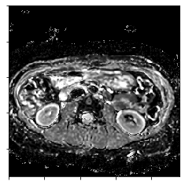

# PyDWI
> Fast ADC and DKI maps from DWI.


## Install

`pip install pydwi`

## How to use

`PyDWI` supports interactive usage __only__ at the moment. Command-line usage is planned for the future.

```python
from PyDWI.core import DWIDataset, get_ADC_dataset, get_DKI_dataset, save_nii, show
```

First, instantiate a `DWIDataset` class:

```python
data = DWIDataset("1.dcm")
```

    Loading and rescaling...
    Successfully loaded Dataset


You can have get information about the dataset by printing `data.info`

```python
print(data.info)
```

    DICOMDataset with 185 slices in groups of 5 slices each
            rescaled with slope 1.7836 and intercept 0.0000.


You can get information about the logical slice groups using `data.slice_groups`

```python
data.slice_groups
```


    [SliceGroup at position [-83.12] with instance numbers [4 8 12 16 20],
                      b_values [0 50 300 600 1000] and 5 slices.,
     SliceGroup at position [-80.12] with instance numbers [24 28 32 36 40],
                      b_values [0 50 300 600 1000] and 5 slices.,
     SliceGroup at position [-77.12] with instance numbers [44 48 52 56 60],
                      b_values [0 50 300 600 1000] and 5 slices.,
     SliceGroup at position [-74.12] with instance numbers [64 68 72 76 80],
                      b_values [0 50 300 600 1000] and 5 slices.,
     SliceGroup at position [-71.12] with instance numbers [84 88 92 96 100],
                      b_values [0 50 300 600 1000] and 5 slices.,
     SliceGroup at position [-68.12] with instance numbers [104 108 112 116 120],
                      b_values [0 50 300 600 1000] and 5 slices.,
     SliceGroup at position [-65.12] with instance numbers [124 128 132 136 140],
                      b_values [0 50 300 600 1000] and 5 slices.,
     SliceGroup at position [-62.12] with instance numbers [144 148 152 156 160],
                      b_values [0 50 300 600 1000] and 5 slices.,
     SliceGroup at position [-59.12] with instance numbers [164 168 172 176 180],
                      b_values [0 50 300 600 1000] and 5 slices.,
     SliceGroup at position [-56.12] with instance numbers [184 188 192 196 200],
                      b_values [0 50 300 600 1000] and 5 slices.,
     SliceGroup at position [-53.12] with instance numbers [204 208 212 216 220],
                      b_values [0 50 300 600 1000] and 5 slices.,
     SliceGroup at position [-50.12] with instance numbers [224 228 232 236 240],
                      b_values [0 50 300 600 1000] and 5 slices.,
     SliceGroup at position [-47.12] with instance numbers [244 248 252 256 260],
                      b_values [0 50 300 600 1000] and 5 slices.,
     SliceGroup at position [-44.12] with instance numbers [264 268 272 276 280],
                      b_values [0 50 300 600 1000] and 5 slices.,
     SliceGroup at position [-41.12] with instance numbers [284 288 292 296 300],
                      b_values [0 50 300 600 1000] and 5 slices.,
     SliceGroup at position [-38.12] with instance numbers [304 308 312 316 320],
                      b_values [0 50 300 600 1000] and 5 slices.,
     SliceGroup at position [-35.12] with instance numbers [324 328 332 336 340],
                      b_values [0 50 300 600 1000] and 5 slices.,
     SliceGroup at position [-32.12] with instance numbers [344 348 352 356 360],
                      b_values [0 50 300 600 1000] and 5 slices.,
     SliceGroup at position [-29.12] with instance numbers [364 368 372 376 380],
                      b_values [0 50 300 600 1000] and 5 slices.,
     SliceGroup at position [-26.12] with instance numbers [384 388 392 396 400],
                      b_values [0 50 300 600 1000] and 5 slices.,
     SliceGroup at position [-23.12] with instance numbers [404 408 412 416 420],
                      b_values [0 50 300 600 1000] and 5 slices.,
     SliceGroup at position [-20.12] with instance numbers [424 428 432 436 440],
                      b_values [0 50 300 600 1000] and 5 slices.,
     SliceGroup at position [-17.12] with instance numbers [444 448 452 456 460],
                      b_values [0 50 300 600 1000] and 5 slices.,
     SliceGroup at position [-14.12] with instance numbers [464 468 472 476 480],
                      b_values [0 50 300 600 1000] and 5 slices.,
     SliceGroup at position [-11.12] with instance numbers [484 488 492 496 500],
                      b_values [0 50 300 600 1000] and 5 slices.,
     SliceGroup at position [-8.12] with instance numbers [504 508 512 516 520],
                      b_values [0 50 300 600 1000] and 5 slices.,
     SliceGroup at position [-5.12] with instance numbers [524 528 532 536 540],
                      b_values [0 50 300 600 1000] and 5 slices.,
     SliceGroup at position [-2.12] with instance numbers [544 548 552 556 560],
                      b_values [0 50 300 600 1000] and 5 slices.,
     SliceGroup at position [0.88] with instance numbers [564 568 572 576 580],
                      b_values [0 50 300 600 1000] and 5 slices.,
     SliceGroup at position [3.88] with instance numbers [584 588 592 596 600],
                      b_values [0 50 300 600 1000] and 5 slices.,
     SliceGroup at position [6.88] with instance numbers [604 608 612 616 620],
                      b_values [0 50 300 600 1000] and 5 slices.,
     SliceGroup at position [9.88] with instance numbers [624 628 632 636 640],
                      b_values [0 50 300 600 1000] and 5 slices.,
     SliceGroup at position [12.88] with instance numbers [644 648 652 656 660],
                      b_values [0 50 300 600 1000] and 5 slices.,
     SliceGroup at position [15.88] with instance numbers [664 668 672 676 680],
                      b_values [0 50 300 600 1000] and 5 slices.,
     SliceGroup at position [18.88] with instance numbers [684 688 692 696 700],
                      b_values [0 50 300 600 1000] and 5 slices.,
     SliceGroup at position [21.88] with instance numbers [704 708 712 716 720],
                      b_values [0 50 300 600 1000] and 5 slices.,
     SliceGroup at position [24.88] with instance numbers [724 728 732 736 740],
                      b_values [0 50 300 600 1000] and 5 slices.]


`len(slice_groups)` gives you the number of usable slices

```python
len(data.slice_groups)
```


    37


You can get additional information on the slice groups:

```python
data.slice_groups[0]
```


    SliceGroup at position [-83.12] with instance numbers [4 8 12 16 20],
                     b_values [0 50 300 600 1000] and 5 slices.


You can see some slices by calling `show`:

```python
data.slice_groups[0].show()
```


You can get ADC maps by calling `get_ADC_dataset`. By default this runs in parallel and is quite fast.

```python
%%time
ADC_maps = get_ADC_dataset(data)
```

    CPU times: user 2.32 s, sys: 42.3 ms, total: 2.36 s
    Wall time: 310 ms


You can get DKI maps by calling `get_DKI_dataset`. This also runs in parallel but takes around 10 minutes per dataset for around 30 slices.

```python
%%time
D_maps, K_maps = get_DKI_dataset(data)
```

    [Parallel(n_jobs=-1)]: Using backend LokyBackend with 16 concurrent workers.


    CPU times: user 1.11 s, sys: 304 ms, total: 1.41 s
    Wall time: 10min 1s


    [Parallel(n_jobs=-1)]: Done  37 out of  37 | elapsed: 10.0min finished


You can have a look at slices by calling `show` which is a utility function

```python
show(D_maps[0])
```


    <matplotlib.image.AxesImage at 0x7fa5c99021d0>





```python
show(K_maps[0])
```


    <matplotlib.image.AxesImage at 0x7fa5bb4d4f90>


Finally, you can save `.nii.gz` files by calling `save_nii` and providing a filename without the `nii.gz`.

```python
save_nii(D_maps, "D_maps")
```
